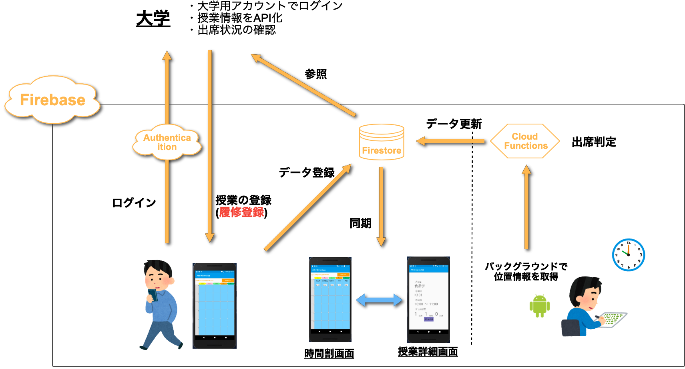
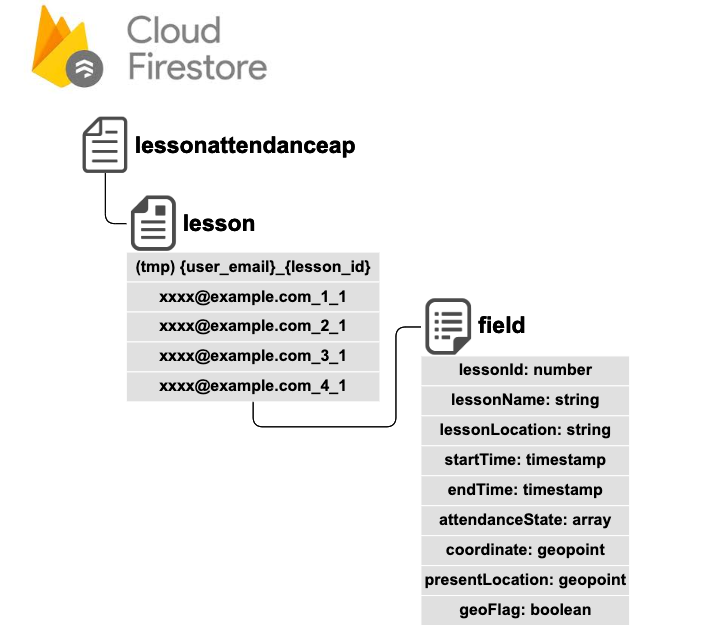
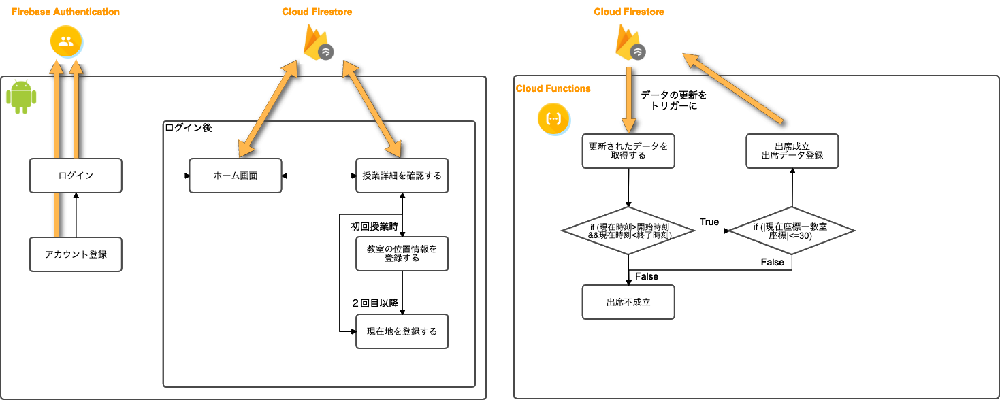

# LessonAttendanceApp

## 開発背景
授業を受けるとき、学生証をスキャナにかざすことで出席情報を登録していた。
しかし、いちいち学生証を出さなければならないことが面倒だと感じた。
また、出席登録をしても、自分が今何回出席していて、何回欠席しているかなどを確認する場所が私の大学にはなかったため、
自分でメモなどで残しておく必要があった。なかなか自分でメモを残すことが面倒だったため、出席が足りているかどうかが
心配になることがあった。そこで、スマホで位置情報を使ったら簡単に出席管理ができると思いこのアプリを開発した。

## 最終システムイメージ
   

## 概要  
***フロントエンド***
- 時間割が出力される(must)
- 授業詳細が出力される(must)
- 授業の座標を取得する(must)
- 授業情報を取得する(want1)
- Android端末で位置情報をバックグラウンドで取得(want2)  

***バックエンド***
- 座標をもとに出席判定を行う(must)
- 授業開始前にプッシュ通知(want3)
- 正常に出席状況をDBへ保存できたことをAndroid側に通知(want4)
    
## 開発環境
***フロントエンド***
- Android Studio 3.5.2
- java 12.0.1
- kotlin 1.3.50

***バックエンド***
- PhpStorm 2019.2.4
- node.js v8.15.0
- デプロイ先: Google Cloud Functions

## DB環境
   

## アプリケーションの動き
   

## 実装終了

## 今後の予定
***フロントエンド***
- 授業情報を取得する(want1)
    - webで公開されている大学のシラバス情報をAPI化することでAndroid側から取得する
- Android端末で位置情報をバックグラウンドで取得(want2) 
    - 現在はボタンを押して位置情報を取得しているため、アプリを開かずバックグラウンドで位置情報を取得可能にする

***バックエンド***
- 授業開始前にプッシュ通知(want3)
    - [Cloud Messaging for Firebase](https://firebase.google.com/docs/cloud-messaging?hl=ja)
    を用い、授業開始前にAndroidへプッシュ通知を送る
- 正常に出席状況をDBへ保存できたことをAndroid側に通知(want4)
    - 出席判定も含めて正常にバックエンド側が機能していることをAndroidへ通知する
    
## 最終目標
大学側と連携して履修登録、履修管理を行うことができるシステムを目指す。  
そのために、以下の機能を実装する必要がある。  
- ログイン機能の強化
    - 各大学ごとの学生用メールアドレスを用いた認証を行う
- 授業情報をAPI化
    - 履修システムと同じように時間割を登録することができるAPIを作成する
- 大学側がFirestoreを参照
    - 大学ごとに学生のデータを参照できるようにする

また、現在アンドロイドアプリのみの開発を行っているが、今後iOSアプリでも開発を行う。
自分の周りにはiPhoneを使っている学生が多いため、iOSへの対応も必要だから。

